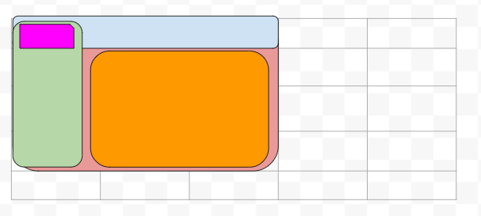
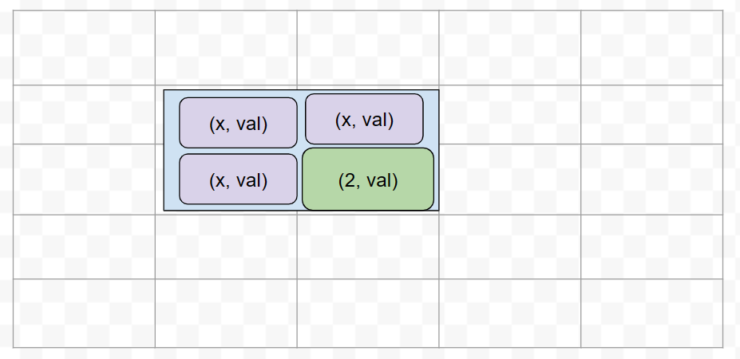
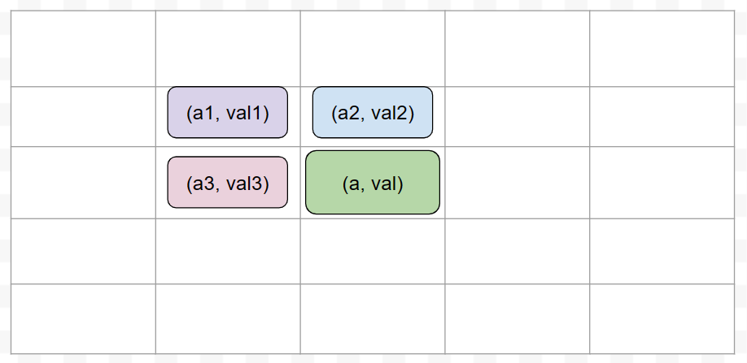
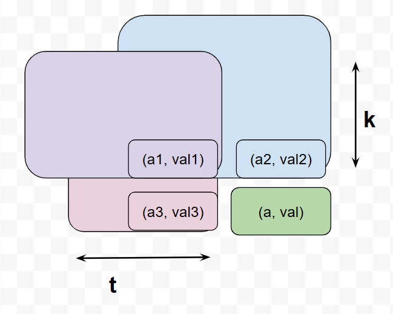

## Bài 10

Cho một ma trận kích thước m×n chứa các số 0 hoặc 1 tại mỗi ô. 

**Yêu cầu:** Tìm hình vuông lớn nhất chứa toàn số 0 hoặc toàn số 1.

**Ví dụ hình ảnh:**

| 1 | 0 | 1 | 0 | 0 |
|---|---|---|---|---|
| 1 | 0 | 1 | 1 | 1 |
| 1 | 1 | 1 | 1 | 1 |
| 1 | 0 | 0 | 1 | 0 |

**Dữ liệu vào**

- Dòng đầu tiên chứa 2 số nguyên dương m và n tương ứng là số lượng dòng và cột của ma trận. (1≤m,n≤100).

- m dòng tiếp theo, mỗi dòng chứa n số 0 hoặc 1 cách nhau bởi khoảng trắng.

**Kết quả**

- Diện tích của hình vuông lớn nhất chứa toàn số 1 hoặc toàn số 1

**Ví dụ:**

|INPUT | OUTPUT|
|:---:|:----:|
4 5 | 2
1 0 1 0 0 |
1 0 1 1 1 |
1 1 1 1 1 |
1 0 0 1 0 |

---------------

## Thuật toán ngây thơ:

**Ý tưởng**

- Tại ô **(i,j)** duyệt qua tất cả các hình vuông có thể tạo được từ điểm bắt đầu này. 
- Kiểm tra xem hình vuông đó có chứa toàn số 0 hoặc toàn số 1 không.
    + Nếu có thì so sánh kết quả với kết quả lớn nhất hiện đang có và cập nhật nếu lớn hơn

**Độ phức tạp**

Tại ô (i,j) 
- Gọi $x = min(m-i, n-j)$
- Số hình vuông có thể tạo được là (x+1) (kích thước từ 1 đến (x+1))
- Với mỗi hình vuông, để check xem có phải toàn số 0 hoặc toàn số 1 không, ta phải duyệt qua toàn bộ các ô.
- Vậy độ phức tạp của duyệt các hình vuông tại ô (i,j) là:
$$\Sigma_{y=0}^{y=x}{(y+1)^2}$$

## Cải tiến - Dùng prefix sum:

Chi phí lớn nhất của thuật toán trên là duyệt qua hết tất cả các ô trong hình vuông để kiểm tra hình vuông đó có phải toàn số 0 hoặc toàn số 1 không. Vì vậy để cải tiến thuật toán này ta giảm thiểu chi phí của bước này bằng cách dùng prefix sum.
 

Giờ ta muốn kiểm tra một hình vuông có cạnh a có đồng nhất hay không thì chỉ cần kiểm tra giá trị tổng của các ô trong hình vuông có là 0 hoặc là $a^2$ không.

Muốn tính giá trị tổng của hình vuông thì ta có thể dùng prefix sum như hình bên:
$$cam = đỏ - xanh lá - xanh dương + tím$$

## Dùng quy hoạch động

Mỗi ô sẽ lưu 2 giá trị là (a, val). Với a là cạnh của hình vuông đồng nhất lớn nhất mà ô (i,j) là điểm cuối cùng. Còn val là giá trị của ô đó (0 hay 1).

Ví dụ một ô mang giá trị là (2,val) sẽ là ô cuối cùng của hình vuông có cạnh là 2 và các giá trị trong hình vuông đó đồng nhất là val.

Ta sẽ đi xây dựng lần lượt giá trị cho các ô và cuối cùng sau khi xây dựng xong ma trận dp thì ta sẽ có được đáp án của bài toán.

Giá trị của ô (i,j) sẽ phụ thuộc vào giá trị của 3 ô kề nó

- Nếu 4 giá trị của 4 ô này không đồng đều (có ít nhất 1 giá trị khác) thì hình vuông lớn nhất có ô (i,j) ở cuối chỉ có thể là chính nó. 
    + Vậy ô (i,j) mang giá trị (1,val)
- Nếu 4 ô giống nhau:
    + Xác định hình vuông lớn nhất mà ô (i,j) thuộc về
    
    + Nó sẽ là: min(k,t) + 1
