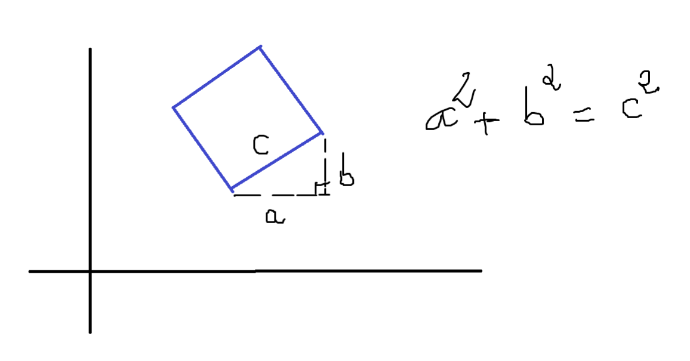
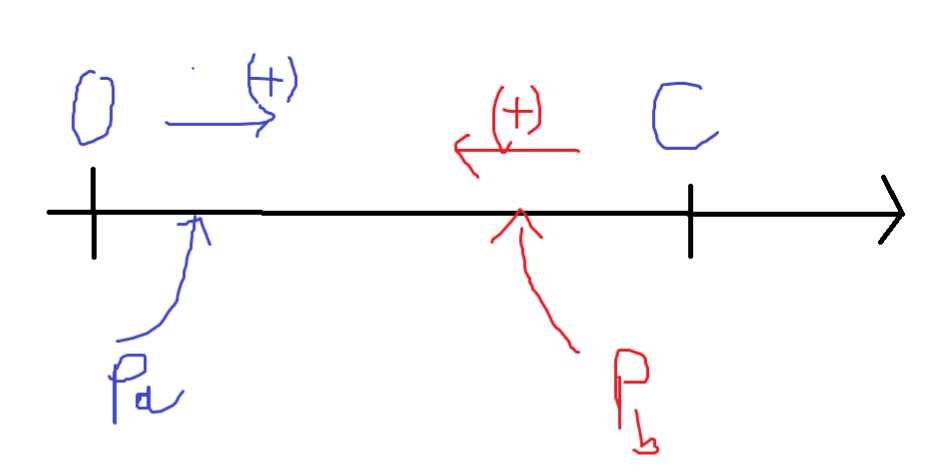

## Bài 12

Hãy chỉ ra cách xây dựng một hình vuông có diện tích là số nguyên dương S cho trước với các tọa độ nguyên trong phạm vi từ $-10^9$ đến $10^9$.

**Input:** Số nguyên dương S≤$10^3$.

**Output:** Tọa độ 4 đỉnh của hình vuông được liệt kê cùng hoặc ngược chiều kim đồng hồ. Trường hợp không có lời giải thì thông báo Impossible.

|INPUT  | OUTPUT |
|:-----:|:------:|
|5      | 1 2
|       | 2 4
|       | 4 3
|       | 3 1
|3      | Impossible

---------------

## Thuật toán ngây thơ

**Mở đầu**

Ta có: $S = c^2 = a^2 + b^2$
- a,b đều là số nguyên dương, do các đỉnh đều có tọa độ nguyên
- $a,b < c$

Nếu tìm được a,b thì việc tìm được các đỉnh rất đơn giản, khi ta chỉ cần cố định một đỉnh tại vị trí bất kỳ và đi tìm tọa độ của các đỉnh còn lại dựa trên a,b. Vậy bài toán đưa trở về tìm a,b nguyên dương sao cho $S = c^2 = a^2 + b^2$.

**Ý tưởng**

Từ 2 điều kiện trên của a,b:
- a,b đều là số nguyên dương, do các đỉnh đều có tọa độ nguyên
- $0 <a,b < c$

Ta sẽ dùng 2 con trỏ để đi tìm a,b trên đoạn [0,c]

Thuật toán dừng khi ta tìm được 1 cặp (a,b) thỏa
