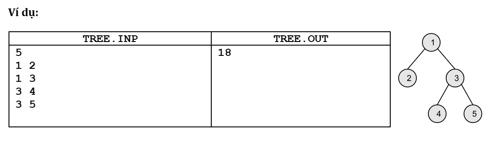
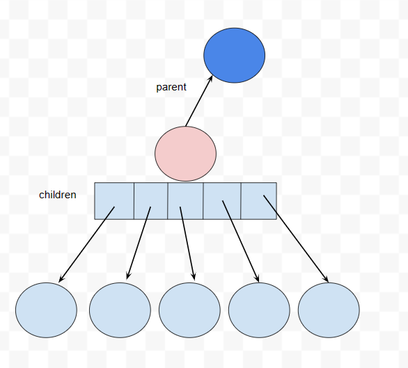
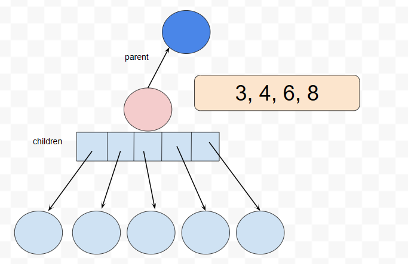

## Bài 16

Cho một cây n đỉnh. Khoảng cách giữa 2 đỉnh u,v là số cạnh trên đường đi từ u đến v. Độ rộng của cây là tổng khoảng cách giữa tất cả cặp đỉnh u,v (u < v). Hãy xác định độ rộng của cây.

**Dữ liệu vào**

- Dòng đầu tiên: n (với n ≤ $10^3$).
- n-1 dòng tiếp theo: ui,vi – một cạnh của cây.

**Kết quả:**

- Gồm một số nguyên duy nhất là độ rộng của cây.



--------

## Một số suy nghĩ ban đầu:

**Cây**:
- Đồ thị liên thông
- Vô hướng
- Không chu trình

==> Tồn tại đường đi **duy nhất** giữa 2 đỉnh u,v bất kỳ trên cây (không đi lặp lại đỉnh nào)

**Tính độ rộng của cây**
- Duyệt qua lần lượt các cặp đỉnh (u,v) và tính khoảng cách của 2 đỉnh đó
- Độ rộng = tổng khoảng cách

**Độ phức tạp:** $O(n^2 * D)$ 
- $O(n^2)$ duyệt qua lần lượt các cặp đỉnh
- $O(D)$ chi phí tính khoảng cách giữa 2 đỉnh

## Cách lưu trữ cây:

Vì không biết mỗi đỉnh sẽ có tối đa bao nhiêu nút nên một đỉnh phải giữ một danh sách các con trỏ đến các nút con của nó. Và vì cây vô hướng, nên để tìm được đường đi ngược lên trên thì phải có 1 con trỏ để giữ nút cha.



Để lưu trữ danh sách các con thì có thể có nhiều cấu trúc dữ liệu phù hợp cho việc lưu trữ, tra cứu và mở rộng danh sách.
- Mảng
- Danh sách liên kết

Vì số nút con cũng không quá nhiều nên dùng mảng cho dễ.

```c++
struct TreeNode{
    int val;     // tên của đỉnh 
    TreeNode* parent;
    vector<TreeNode*> children;
};
```

## Thuật toán ngây thơ:

Cài đặt thuật toán đi tìm khoảng cách giữa 2 đỉnh trên cấu trúc cây vừa nêu:
- Phải dùng tìm kiếm không có thông tin (vì không biết nút cần tìm sẽ ở hướng nào) 
    + Dùng DFS sẽ cho kết quả trung bình tốt. 
    + Còn BFS hoặc UCS sẽ tốn chi phí lớn với các nút ở xa (gần như phải duyệt cả cây)
- Chi phí của mỗi lần tìm kiếm là: $O(n)$ - trường hợp xấu nhất phải duyệt qua tất cả các cạnh.

**Các hàm cần phải cài đặt:**
- Hàm tìm nút có giá trị val - để tìm nút u trong cây
    + Dùng đệ quy đi từ gốc (không quay lui lên)
    ```c++
    TreeNode* findNode(TreeNode* root, int val){
        if (root->val == val) return root;
        if (root->children.size() == 0){ //leaf - wrong
            return nullptr;
        }
        for (TreeNode* child : root->children){
            TreeNode* res = findNode(child, val);
            if (res != nullptr) return res;
        }
        return nullptr;     //val is not in this branch
    }
    ```
- Hàm tính khoảng cách từ nút u đến nút v
    + Tìm nút u (đã có hàm ở trên)
    + Dùng dfs để tìm từ nút u đến nút có giá trị v
    ```c++
    int distance(TreeNode* root, int u, int v){
        //calculate distance from u to v (u < v)
        //using dfs
        TreeNode* u_node = findNode(root, u);

        return dfs(u_node, nullptr, u, v, 0);
    }
    ```
- Hàm `dfs` để tính khoảng cách từ nút u -> v
    + Đầu vào:
        - `findingNode`: nút đang tiến hành tìm kiếm
        - `prevNode` : nút trước đó gọi đến dfs của nút này - dùng để check nhằm tránh gọi dfs của nút vừa mới gọi nó (lặp vô tận)
        - `u`, `v`: giá trị u, v
        - `curDistance` : khoảng cách đã đi được từ nút u cho đến khi gọi hàm dfs này

    + Nếu nút hiện tại là nút v -> dừng và trả về khoảng cách đã đi
    + Nếu không phải là nút v:
        - Gọi dfs của các nút con nó. Nếu có 1 nhánh tìm được v thì return. 
        - Gọi dfs của nút cha nó. Nếu tìm được v thì return
    + Nếu duyệt qua hết rồi mà ko tìm được v thì v không có ở trong nhánh này -> return 0

## Tối ưu hóa:

Có một số phương án:
- Lưu thêm thông tin để biết nút cần tìm sẽ nằm ở hướng nào - thay vì phải đi tìm mù ở toàn bộ cây.
- Thay vì lưu theo cấu trúc từ trên xuống như 1 cây -> lưu thành 1 đồ thị vô hướng (bỏ đi nút parent)
- Tận dụng lại thông tin cũ - thay vì mỗi lần tính khoảng cách thì phải tính lại từ đầu.

## Lưu thêm thông tin:

Mỗi nút lưu thêm thông tin về các nút con có thể đến được từ nó. Giúp khi tìm kiếm ta có thể bỏ qua nhanh các nhánh không có nút cần tìm.



Có thể lưu danh sách này bằng 1 mảng, 1 linked list hoặc nếu danh sách lớn thì có thể lưu bằng hashtable.

```c++
struct TreeNode{
    int val;     // tên của đỉnh 
    vector<int> list; //danh sách các đỉnh con có thể đến được từ nút này
    TreeNode* parent;
    vector<TreeNode*> children;
};
```


