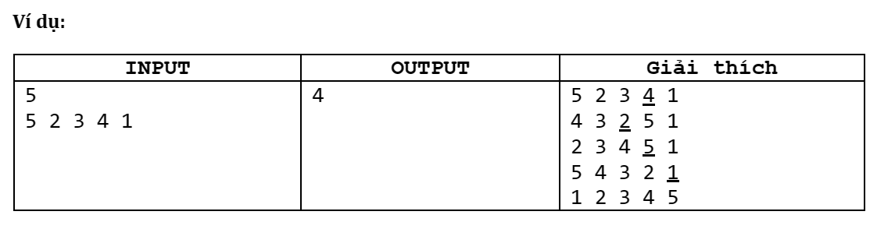

# Bài 18

Cho dãy số $a_1,a_2,…,a_n$ là một hoán vị của các số từ 1 đến n. Có thể thực hiện thao tác sau trên dãy số: chọn vị trí i (2 ≤ i ≤ n) và đảo ngược thứ tự các phần tử $a_1,a_2,…,a_i$, các phần tử còn lại giữ nguyên.

**Yêu cầu:** Tìm số thao tác thực hiện ít nhất để dãy có thứ tự tăng dần.

**Dữ liệu vào:**

- Dòng đầu tiên: n1 ≤ n ≤ 8
- Dòng thứ hai: $a_1,a_2,…,a_n$

**Kết quả:**

- Gồm một số duy nhất là số thao tác ít nhất.

------------------------------------

## Bắt đầu:

Đầu tiên, suy nghĩ 1 cách nào đó để giải được bài toán đưa dãy $a_1,a_2,…,a_n$ về thứ tự tăng dần bằng phép *chọn* mà đề cho, trước khi suy nghĩ làm sao để thực hiện với số thao tác ít nhất.

Ta sẽ suy nghĩ theo hướng đệ quy, xét ví dụ dãy: **5 2 3 4 1**
- Để đưa được về dãy **1 2 3 4 5** thì ta phải có được dãy **5 4 3 2 1**, sau đó *chọn* ở vị trí cuối cùng (số 1).
- Ta sẽ làm theo cách là **lần lượt đưa các số về đúng vị trí theo thứ tự 5 4 3 2 1**.
    + May mắn là ta đã có vị trí số 1 ở cuối cùng, giờ ta cần đưa các số còn lại về đúng vị trí. **5 2 3 4** thành **5 4 3 2**. Giờ ta chỉ còn làm việc với 4 số đầu.
    + Tiếp theo ta đưa số 2 về vị trí cuối cùng trong dãy mới.
    + Để đưa được số 2 về cuối trong dãy thì phải đưa được số 2 về đầu, sau đó *chọn* tại vị trí cuối để số 2 thành vị trí cuối
        - Hình dung: **abcd 2 ef** -> **2 dcba ef** --> **fe abcd 2**
    + Làm tương tự với các số tiếp theo và ta có cách giải tổng quát và chính xác.

## Nhận xét:

- Với cách làm trên mỗi lần ta chỉ có thể đưa 1 số về cuối cùng.
- Trong khi ta có thể đưa nhiều số về đúng vị trí trong cùng 1 lượt.

Ví dụ: 
- 5 2 3 4 (chọn tại 4)
- 4 3 2 5 (chọn tại 2)
- 2 3 4 5 (chọn tại 5)
- 5 4 3 2 (đã đưa được 4 số về đúng vị trí trong 1 lượt)

Ở đây ta có thể nhận xét rằng, trong trường hợp này ta muốn đưa số 2 về cuối. Và ta đang có dãy liên tiếp **2 3 4** luôn nên ta có thể đưa luôn dãy này về đúng vị trí trong cùng 1 lần. Cách làm thì như ví dụ đã thấy.

Với cách làm này thì cách giải trên sẽ là tối ưu. 

**Chứng minh:**

Giả sử, tiếp theo ta muốn đưa $a_i$ về đúng vị trí trong dãy $xxx a_i yyy zzz ttt$
Trong đó, 
- **xxx** là các phần tử đứng trước $a_i$
- **yyy** là các phần tử đứng sau $a_i$ mà chưa về đúng vị trí, $a_i$ và **yyy** tạo thành dãy liên tiếp tăng dần 
- **zzz** là các phần tử đứng sau $a_i$ mà chưa về đúng vị trí
- **ttt** là các phần tử đứng sau $a_i$ mà đã về đúng vị trí

Vậy giờ nếu ta chỉ đưa $a_i$ về đúng vị trí
- $xxx a_i yyy zzz ttt$
- $a_i (xxx) yyy zzz ttt$ (dấu ngoặc ký hiệu cho đã bị đảo ngược)
- $ (zzz) (yyy) xxx a_i ttt$
Ta thấy rằng $(yyy)$ là các phần tử tiếp theo phải được đưa về vị trí đúng đã đang ở vị trí sai. Đáng lẽ ở vị trí chỗ $xxx$ mới đúng. Vậy ta cần phải làm thêm một số bước nữa để đưa các phần tử trong $(yyy)$ về đúng chỗ.

Còn nếu ta đưa cả đoạn $a_i yyy$ về đúng chỗ chung 1 lần:
- $xxx a_i yyy zzz ttt$
- $(yyy) a_i (xxx) zzz ttt$ (dấu ngoặc ký hiệu cho đã bị đảo ngược)
- $ (zzz) xxx (yyy) a_i ttt$
Với số bước tương tự ta vừa đưa được $a_i$ và cả các phần tử tiếp theo $(yyy)$ về đúng vị trí.

## Giải bài toán:

Ta sẽ kết hợp cách giải tổng quát và nhận xét đã có để đưa ra lời giải cho bài toán tìm số thao tác ít nhất để giải bài toán.

- Đưa lần lượt các phần tử về vị trí đúng trong thứ tự đảo ngược (**5 4 3 2 1**)
- Nếu trong một lượt ta có thể đưa về nhiều hơn 1 phần tử thì thực hiện điều đó.