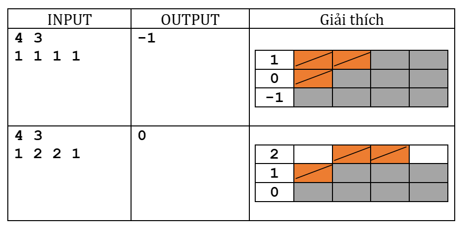
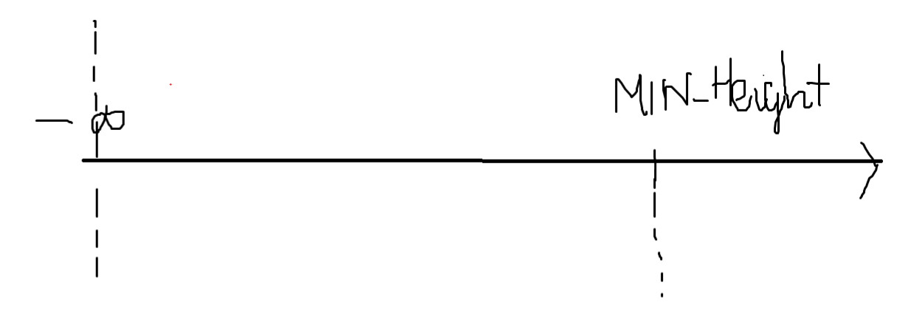

# Bài 19:

Cho n đoạn liên tiếp, đoạn thứ i có chiều cao $h_i$. Chiều cao chênh lệch giữa 2 đoạn liên tiếp không vượt quá 1 đơn vị. Ta cần đào sâu xuống càng sâu càng tốt. Ta dự định chi T đồng cho công việc này. Chi phí giảm chiều cao của một đoạn đi 1 đơn vị là 1 đồng.

**Yêu cầu:** Cho biết các chiều cao h1, h2, …, hn và chi phí T. Hãy xác định chiều cao thấp nhất (đào sâu nhất) mà ta có thể đào được với T đồng mà vẫn đảm bảo chênh lệch giữa 2 đoạn liên tiếp không quá 1 đơn vị.

**Dữ liệu vào:**

- Dòng đầu chứa 2 số nguyên dương n, T (n≤105, m≤1018)
- Dòng thứ 2 chứa n số nguyên không âm a1, a2, …, an(0≤ai109)

**Kết quả**

- Gồm một số nguyên duy nhất là độ cao thấp nhất mà công ty có thể đào được

**Ví dụ**

----------

## Ý tưởng:

Ta đi tìm đáp án theo phương pháp dò đáp án trên đoạn.

Kết quả của chúng ta sẽ nằm trong đoạn từ -INF (~$10^đến Min_Height.

Nếu dò từng đáp số thì không thể --> Dò bằng chặt nhị phân:
> Mỗi lần ta sẽ chia đoạn chứa kết quả cần tìm 
