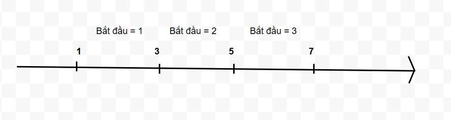

## Bài 20

Xét tất cả các hoán vị của dãy số tự nhiên (1,2, … , 𝑛). Giả sử rằng các hoán vị được sắp xếp theo thứ tự từ điển và đánh số từ 1 tới 𝑛! 

- Ví dụ với 𝑛 = 3, có 6 hoán vị: (1,2,3); (1,3,2); (2,1,3); (2,3,1); (3,1,2); (3,2,1) 

**Yêu cầu:** Cho trước một hoán vị $(p_1,p_2,…, p_n)$ hãy cho biết số thứ tự 𝑥 của hoán vị đó và ngược lại: Cho trước một số thứ tự 𝑦 (1 ≤ 𝑦 ≤ 𝑛!) hãy tìm dãy hoán vị $(q_1,q_2,…, q_n)$ mang số thứ tự 𝑦. 

**Dữ liệu vào:** 
- Dòng 1: Chứa 𝑛 số $(p_1,p_2,…, p_n)$ (𝑛 ≤ 20) 
- Dòng 2: Chứa số 𝑦 

**Kết quả:** 
- Dòng 1: Ghi số 𝑥 
- Dòng 2: Ghi 𝑛 số $(q_1,q_2,…, q_n)$

**Ví dụ:** 
INPUT | OUTPUT
:----:|:----:
2 1 3 | 3
4     | 2 3 1

---------------------

## Bắt đầu:

**Bài toán đầu: tìm vị trí của hoán vị**:

Về hoán vị, ta thấy nếu có n số thì số hoán vị bắt đầu bằng mỗi số là bằng nhau. Ví dụ có 2 hoán vị bắt đầu bằng số 1, thì cũng có 2 hoán vị bắt đầu bằng số 2, ... và cũng có 2 hoán vị bắt đầu bằng số n.

Vì các hoán vị được sắp xếp theo thứ tự bảng chữ cái. Vậy từ chữ số đầu tiên của hoán vị ta sẽ biết được hoán vị đó nằm trong đoạn nào.

Tương tự như vậy, trong một đoạn, ta cũng có thể chia nhỏ hơn dựa vào chữ số thứ 2. Và cứ tiếp tục như vậy với chữ số thứ 3, thứ 4,... Cuối cùng ta sẽ xác định chính xác được vị trí của hoán vị đó trong danh sách.

**Bài toán đầu: tìm hoán vị khi cho vị trí**:

Làm ngược lại với bên trên, ta sẽ xác định nó thuộc đoạn lớn nào (chữ số bắt đầu). Rồi tiếp tục xác định nó thuộc đoạn nhỏ nào trong đoạn lớn đó (chữ số thứ 2),... và tiếp tục.

**Độ phức tạp**

Ta cần làm chính xác n bước để xác định được vị trí/dãy số -> $O(n)$.

