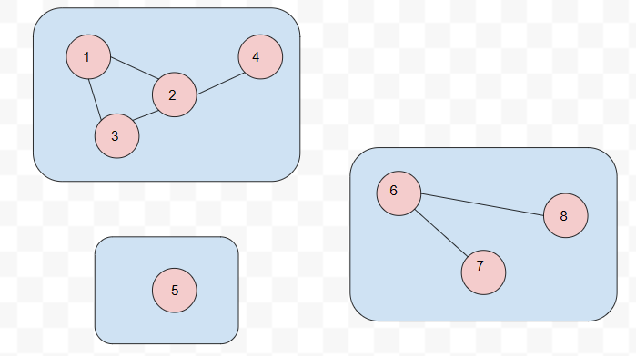
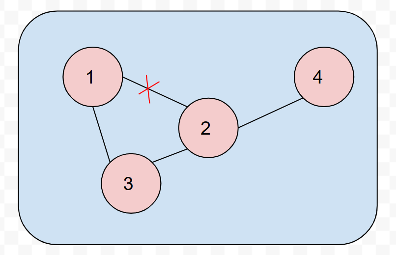
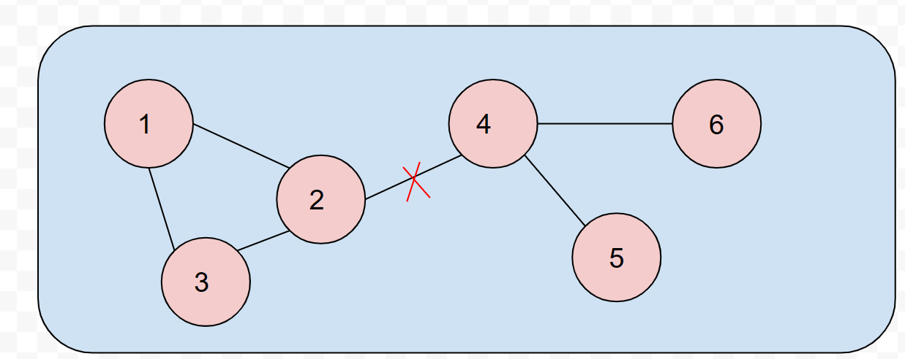
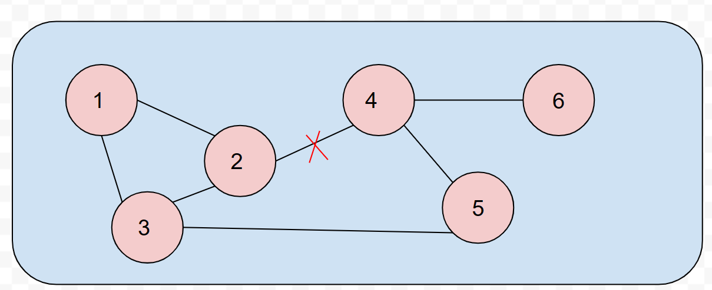

# Bài 22

Trong một xứ sở huyền bí, có một vương quốc tên là Graphonia, nơi có N thành phố và M con đường kết nối chúng với nhau. Vua của Graphonia quyết định tối ưu hóa hệ thống giao thông trong vương quốc của mình. Ông muốn biết số lượng thành phố mà không thể đến được nhau nếu loại bỏ mỗi con đường trong hệ thống giao thông.

----------

## Bắt đầu:

Đây là một đồ thị vô hướng, vì đường có thể đi 2 chiều. Các thành phố không đến được với nhau khi nó nằm ở 2 thành phần liên thông riêng biệt.

Vậy bài toán này là đi xác định các thành phần liên thông của đồ thị. Và sau đó tính số cặp thành phố tạo ra bởi 2 thành phần liên thông khác nhau.

## INPUT:

- Dòng đầu: N và M
- M dòng tiếp theo: 2 số nguyên u v (thể hiện con đường giữa 2 thành phố u và v)

**Ví dụ:**

8 6  
1 2  
1 3  
2 3  
2 4  
6 7  
6 8

**số lượng thành phố không đến được với nhau khi chưa bỏ con đường nào**: 19

## Cách giải:

- Dùng mảng 2 chiều lưu danh sách các thành phần liên thông - mỗi vector sẽ là 1 thành phần liên thông
- Khi loại bỏ 1 con đường thì cập nhật lại thành phần liên thông chứa 2 đỉnh u và v đường đó. Sẽ xảy ra các trường hợp:
    + TH1: Thành phần liên thông này chỉ chứa 2 đỉnh u và v --> Tách thành 2 thành phần liên thông
    + TH2: u,v thuộc thành phần liên thông có 3 phần tử trở lên:
        - a. Tạo ra 2 thành phần liên thông (đường giữa u-v là cầu nối giữa 2 thành phần liên thông này)
        - b. Vẫn giữ nguyên thành phần liên thông này (đường u-v không phải là cầu nối duy nhất)

Vậy để giải bài toán này ta cần thực hiện các công việc:
- Đọc dữ liệu vào
- Lần lượt loại bỏ các con đường và tính số thành phố không đến được với nhau

**Độ phức tạp:**
- Tạo ra các thành phần liên thông từ đồ thị : O(M*N)
    + Duyệt qua M cạnh
    + Mỗi cạnh xét xem 2 đỉnh đã nằm trong thành phần liên thông nào chưa
    + Chi phí xét xem đã nằm trong thành phần liên thông nào chưa là $O(N)$ - do có tối đa N thành phần liên thông
    + Thêm 2 đỉnh đó vào thành phần liên thông tương ứng hoặc gộp 2 thành phần liên thông lại với nhau
- Lần lượt loại bỏ các con đường và tính số thành phố không đến được với nhau:
    + Duyệt qua M cạnh và bỏ 1 cạnh $O(M)$
    + Tạo ra đồ thị mới và thành phần liên thông mới $O(M*N)$
    + Đếm số lượng các cặp thành phố không đến được với nhau - thao tác này sẽ dựa trên kích thước của mỗi thành phần liên thông. Đem nhân 2 kích thước lại với nhau --> $O(X^2)$ với X là số thành phần liên thông. Hay là $O(N^2)$ vì X <= N.

    Vậy độ phức tạp là $O(M * M *N)$ hoặc $O(M * N * N)$ tùy xem M hay N lớn hơn.
    Hay tổng quát, gọi Y = max(M, N). ĐPT: $O(M * Y * Y)$

## Nhận xét:

Với cách giải đầu tiên (trong `P22.cpp`) mỗi lần bỏ một con đường ta phải tạo lại một graph mới và thực hiện lại việc tính toán từ đầu trên graph mới này. Tốn M lần chi phí để tính các thành phần liên thông mới. Trong khi mỗi lần loại bỏ 1 con đường thì chỉ có 2 đỉnh bị ảnh hưởng.

--> Từ thành phần liên thông ban đầu, modify nó để có được thành phần liên thông mới mỗi khi bỏ 1 cạnh.

## Cải tiến:

Với mỗi cạnh bị loại bỏ, ta sẽ xét lại thành phần liên thông mà chứa nó.
+ Nếu chỉ có 2 đỉnh (chính là 2 đỉnh u, v) --> Tách thành 2 thành phần liên thông nhỏ hơn, mỗi cái có 1 đỉnh
+ Nếu nhiều hơn 2, tạo lại thành phần liên thông mới từ tất cả các cạnh mà chứa đỉnh trong thành phần liên thông này. Và thêm thành phần liên thông mới này thay thế vị trí cũ.
    - Ví dụ:
    
    - Nếu bỏ cạnh 1-2, thì ta sẽ tạo lại thành phần liên thông này từ tất cả các cạnh có trong thành phần liên thông cũ (trừ 1-2): đó là 1-3, 2-3, 2-4
    - Làm vậy để xét được tất cả các trường hợp. Ví dụ như trường hợp này, khi loại bỏ cạnh 2-4 sẽ phải xét lại rất phiền. Thay vì vậy thì tạo luôn thành phần liên thông mới từ các cạnh thì sẽ khỏe hơn.
    
    

**Độ phức tạp**: về cơ bản độ phức tạp sẽ không đổi khi trong trường hợp xấu nhất - tất cả đồ thị là một thành phần liên thông thống nhất, thì mỗi lần tạo lại thành phần liên thông chứa cạnh u,v cũng là tạo lại tất cả thành phần liên thông.

Tuy nhiên trong trường hợp trung bình thì sẽ hiệu quả hơn do ta chỉ cần xét duy nhất thành phần liên thông bị ảnh hưởng.