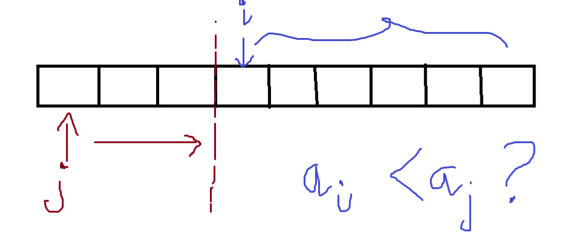
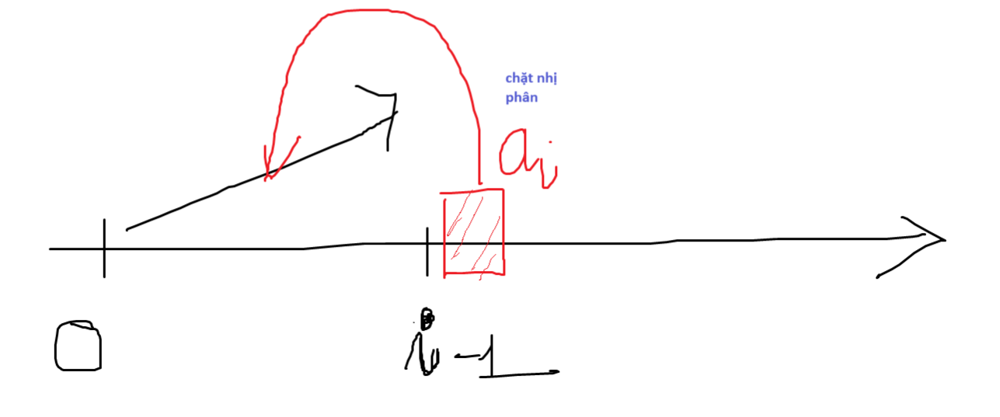
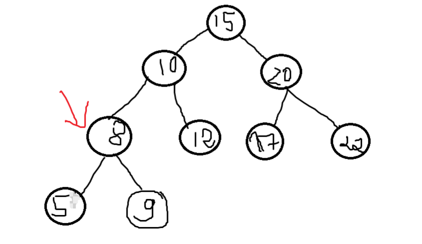
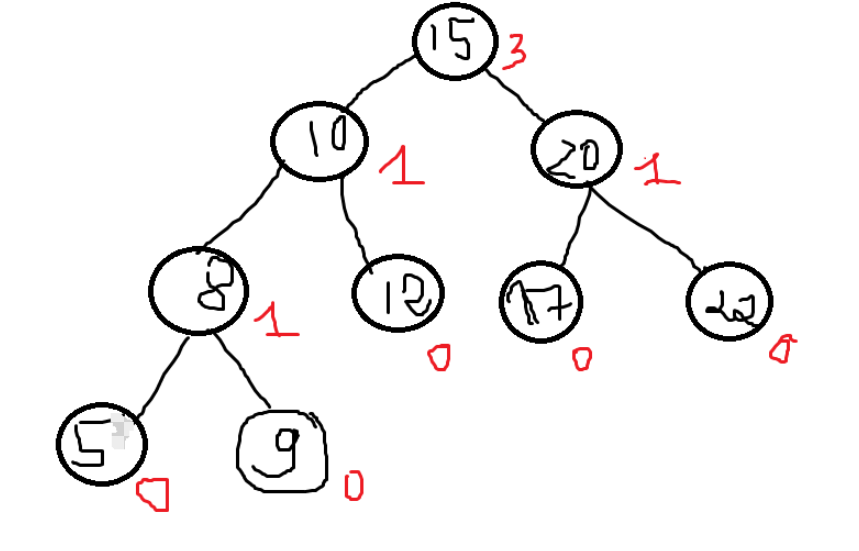
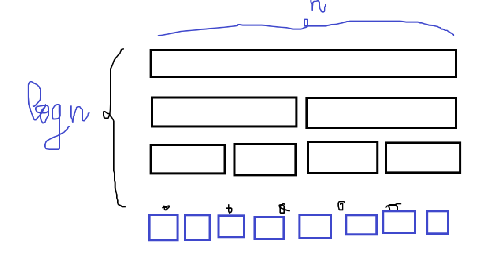
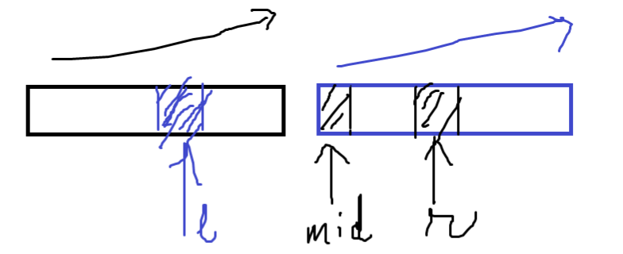

# Bài 4

Cho số $n$ và một dãy gồm n số $a_1,a_2,…a_n$. Định nghĩa cặp số nghịch nhau là cặp hai số $a_i$ và $a_j$ trong dãy thỏa điều kiện $i < j$ và $a_i > a_j$. 

**Yêu cầu**: Đếm số lượng các cặp số nghịch nhau trong dãy.  

**Dữ liệu vào**:
- Dòng đầu tiên chứa một số nguyên $n$ với $1 ≤ n ≤5×10^4$.  
- Dòng thứ 2 chứa $n$ số nguyên $a_1,a_2,…a_n$ ($-2^{31} ≤ a_i ≤ 2^{31} - 1$).  

**Kết quả**:  
- Gồm một số nguyên duy nhất là số lượng các cặp số nghịch nhau trong dãy.

**Ví dụ**:
INPUT       | OUTPUT
:----:      |:-----:
6           | 5
1 2 4 3 5 1 |    

-----

## Thuật toán ngây thơ

**Ý tưởng**
- Dùng 2 vòng lặp lồng nhau duyệt qua tất cả các cặp số $(a_i, a_j)$ (có thể tạo được) trong mảng.
- Kiểm tra xem cặp số này có nghịch nhau hay không. Nếu có cộng kết quả lên 1.

**Độ phức tạp**: $O(n^2)$

**Cài đặt:**

```c++
int naive_solution(vector<int> nums){
    int count = 0;
    for (int i = 0; i < nums.size() - 1; i++){
        for (int j = i+1; j < nums.size(); j++){
            if (nums[i] > nums[j])
                count++;
        }
    }
    return count;
}
```

hoặc làm ngược lại

```c++
int naive_solution(vector<int> nums){
    int count = 0;
    for (int i = 1; i < nums.size(); i++){
        for (int j = 0; j < i; j++){
            if (nums[i] < nums[j])
                count++;
        }
    }
    return count;
}
```



**Ưu điểm:**
- Đơn giản
- Không động tới cộng trừ nhân chia các phần tử nên không cần xét trường hợp tràn số
- Không tốn thêm bộ nhớ

**Nhược điểm:**
- $O(n^2)$ vẫn còn lớn

## Tối ưu hóa bằng cách sắp xếp lại mảng đã duyệt qua

Nhìn vào cách làm thứ 2 để dễ hình dung thuật toán cải tiến:


Nếu không dùng một cấu trúc dữ liệu khác. Để cải tiến thời gian thì ta phải tối ưu được vòng lặp thứ hai dùng để tìm phần tử $a_j$ nghịch thế. Thay vì dùng vòng lặp tốn thời gian tuyến tính thì ta muốn đưa về $O(log)$

> **Sắp xếp lại mảng từ 0 -> i**

**Ý tưởng:**
- Ta có một mảng trong đoạn $[0,a_{i-1}]$ đã được sắp xếp tăng dần.
- Khi xét phần tử thứ $i$. Để kiểm tra xem có bao nhiêu phần tử trong đoạn $[0,a_{i-1}]$ lớn hơn $a_{i}$ (số nghịch thế) ta chỉ cần dùng chặt nhị phân.
    

- Và chèn $a_i$ vào vị trí đó để ta lại có đoạn từ $[0,a_{i}]$ được sắp xếp tăng.

**Chi phí:**  

Với (x <= n) là số phần tử trong đoạn $[0,a_{i-1}]$:
- Chặt nhị phân để tìm vị trí (lower bound) : $O(log(x))$ 
- Chèn $a_i$ vào đúng vị trí để tạo ra mảng tăng : $O(x)$

**Độ phức tạp:** Vẫn là $O(n^2)$ do chi phí chèn $a_i$ vẫn là $O(n)$

## Cải tiến chi phí chèn của thuật toán trên:

Để cải tiến chi phí chèn một phần tử mới vào danh sách thành $O(logn)$ thì ta dùng cây nhị phân tìm kiếm cân bằng (như AVL hay cây Đỏ-Đen). Trong C++ có hỗ trợ sẵn cấu trúc dữ liệu `std::set` cài đặt bằng cây nhị phân tìm kiếm cân bằng.



- Khi thêm 1 nút vào thì ta chỉ tốn $O(logn)$
- Để đếm số lượng các nút lớn hơn nó (số lượng nghịch thế) thì ta chỉ cần đếm số lượng các nút ở nhánh con bên phải + số nút nằm ở bên phải nó.

Ví dụ: Muốn đếm có bao nhiêu nút lớn hơn nút 8 ta cần làm 2 việc:

- Tính số nút con của nhánh con bên phải của 8 (nhánh chứa 9)
- Tính số nút ở phía bên phải của nó (từ 10 trở đi)

Để tính số nút này chỉ có cách là duyệt qua từng nút --> $O(n)$
- Từ nút 15 (gốc), đi tìm nút 8 
- Thấy 8 < 15, phải tính tổng số nút ở nhánh phải 15 (có 3 nút)
- Tiếp tục tới nút 10, vẫn > 8. Phải tính tổng số nút ở nhánh phải 10 (có 1 nút)
- Tới nút 8, đã tìm thấy nút 8. Tính số nút con ở nhánh phải của 8 (1 nút)

=> Tổng có: (3+1) + (1+1) + 1 nút lớn hơn 8.

> Vậy khi cải thiện chi phí chèn thì chi phí đếm số nút lớn hơn lại trở thành $O(n)$

## Cải thiện cấu trúc cây cân bằng:



Mỗi nút ngoài lưu giá trị còn lưu thêm số nút ở nhánh phải

--> Ta có thể đếm số nút lớn hơn trong lúc đi tìm nút.

Ví dụ: Tìm số nút lớn hơn nút 8
- Ở nút gốc (15), có 3 nút nhánh phải + thêm 1 nút 15
- Đi tiếp đến nút 10, có 1 nút ở nhánh phải + thêm 1 nút 10
- Đi tới nút 8 (đã tìm thấy) và có 1 nút ở nhánh phải.

=> Tổng: (3+1) + (1+1) + 1 = 7 nút lớn hơn nút 8.

**Độ phức tạp:** $O(logn)$

Tuy nhiên ta cần customize cách chèn, xoay và update cây khi mất cân bằng.

Tuy nhiên khi cân bằng lại thì trong trường hợp xấu ta phải lan truyền cả cây --> Vẫn là $O(n)$. 

Và trong bài toán chúng ta luôn phải thêm node vào cây liên tục. Cây sẽ liên tục bị mất cân bằng. Vì vậy chi phí để cân bằng lại cây sẽ rất thường xuyên.

Vì vậy, việc tối ưu hóa độ phức tạp thời gian của chèn sẽ không hiệu quả.

## Cách giải quyết khác:

Để giảm $O(n^2)$ về $O(n*logn)$ thì phương pháp đầu tiên có thể nghĩ tới là chia để trị.



Để giải bài toán với n phần tử thì ta chia bài toán thành 2 bài toán nhỏ hơn, mỗi bài toán con gồm n/2 phần tử. 

Giải hai bài toán con đó và **merge** kết quả lại với nhau. Gộp kết quả ở đây không có nghĩa là cộng 2 kết quả lại là xong, mà là có 2 kết quả đó rồi, phải xử lý thế nào để đưa ra kết quả của bài toán lớn.

Đối với mỗi bài toán con, ta lại chia nó làm đôi. Một cách đệ quy như vậy đến khi có thể giải được dễ dàng (còn 1 phần tử).

Có log(n) lần chia, và mỗi lần ta phải xử lý trên n phần tử.

**Cụ thể:**

- Giả sử ta có kết quả của 2 bài toán con là $result_{left}$ và $result_{right}$, thể hiện cho số nghịch thế ở mỗi mảng con.
- Giả sử, sau khi xử lý trên mỗi mảng con xong thì 2 mảng con đều đã được sắp xếp tăng dần.
- Kết quả cuối cùng:  
    $result$ = $result_{left}$ + $result_{right}$ + Số nghịch thế giữa 2 mảng con.

- Vì 2 mảng con đều đã được sắp xếp tăng dần nên việc tìm số nghịch thế giữa 2 mảng con sẽ dễ dàng hơn.
    + Ta dùng 2 con trỏ để duyệt trên 2 nửa --> ĐPT $O(n)$
    

    + Nếu $a_l$ > $a_r$ thì đoạn từ $[l, mid-1]$ sẽ lớn hơn $a_r$. Chúng ta cập nhật số phần tử nghịch thế và tăng r lên từng đơn vị một.
    + Nếu $a_l$ <= $a_r thì ta tiếp tục tăng l đến khi tìm được điều kiện $a_l$ > $a_r$.

- Sau khi tìm được số nghịch thế giữa 2 mảng thì ta gộp 2 mảng lại thành một mảng tăng dần. Dùng merge sort.
