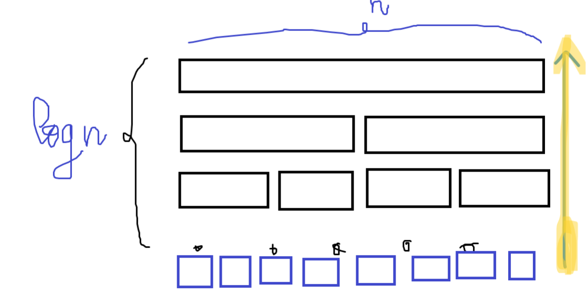
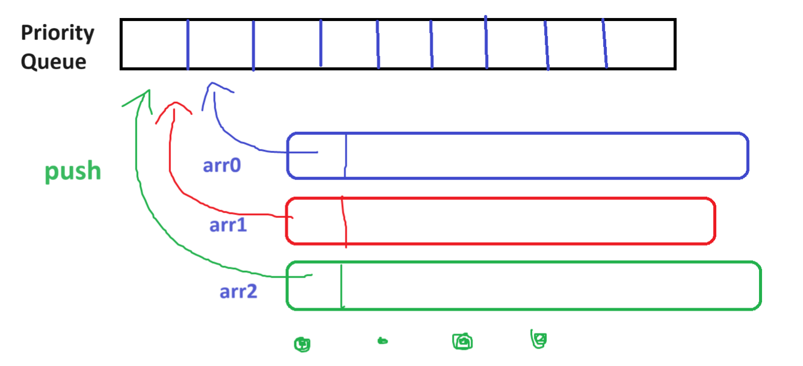

## Bài 6:

Cho k dãy gồm các số nguyên đã được sắp xếp sẵn theo thứ tự tăng dần trong mỗi danh sách. Các phần tử trong dãy có thể có cùng giá trị.

**Yêu cầu**: Hãy gộp tất cả k dãy này lại thành một danh sách đã được sắp xếp theo thứ tự tăng dần.

**Dữ liệu vào**
- Dòng đầu tiên chứa số nguyên k là số lượng các dãy số. $(1≤k≤10^4)$
- k dòng tiếp theo, mỗi dòng chứa một dãy các số nguyên được sắp xếp theo thứ tự tăng dần. Mỗi dòng chứa không quá 500 số nguyên.
- Tổng số lượng các phần tử trong k dãy không vượt quá $10^4$.

**Kết quả**
- Gồm một dòng chứa dãy số đã được gộp lại theo thứ tự tăng dần.

**Ví dụ:**

INPUT | OUTPUT
:----:|:-----:
3   | 1 1 2 3 4 4 5 6
1 4 5 |
1 3 4 |
2 6 |

--------

## Thuật toán ngây thơ:

**Ý tưởng:**
- Tạo mảng kết quả (res)
- Merge lần lượt mảng kết quả với từng mảng trong k mảng. Dùng 2 con trỏ để merge 2 mảng với nhau.

**Độ phức tạp:**
- Thời gian:  
$$n_1 + (n_1 + n_2) + (n_1 + n_2 + n_3) + .. + (n_1 + n_2 + .. + n_k)$$

- Không gian:  
$$n_1 + (n_1 + n_2) + (n_1 + n_2 + n_3) + .. + (n_1 + n_2 + .. + n_k)$$

> Có thể tiết kiệm không gian bằng cách dùng 1 mảng kích thước  $(n_1 + n_2 + .. + n_k)$ làm mảng tạm cố định để merge 2 mảng.

**Ưu điểm**
- Dễ thực hiện

**Nhược điểm**
- Tốn quá nhiều chi phí ~ $O(k/2 * n)$ cả về thời gian và không gian.
    + n : tổng số phần tử cần sắp xếp
    + giả sử mỗi mảng đều có số phần tử bằng nhau.

- Càng về sau càng tốn chi phí.
- Số bước thực hiện ở giai đoạn sau nhiều, do cứ làm từng cái một.

## Chia để trị:

Ta thấy rằng nếu cộng gộp như cách trên thì càng về sau chi phí tốn càng nhiều và chi phí tốn kém cho đoạn sau rất lớn (vì đoạn sau được làm rất chậm - từng cái một --> tốn nhiều bước).

Để giảm bớt chi phí thì phải tăng tốc độ thực hiện (giảm số bước) ở giai đoạn mà kích thước mảng lớn. --> Chia để trị 



**Độ phức tạp:**
- Thời gian: $O(logk * n)$
    + log(k) : số bước thực hiện
    + n : chi phí của mỗi bước

- Không gian: $O(logk * n)$
    + log(k) : số bước thực hiện
    + n : mỗi bước thực hiện cần tốn mảng thêm là n (tổng hết các bộ nhớ thêm của từng lần gộp)

**Ưu điểm:**
- Đã giảm độ phức tạp vì $log(k) << k$ (khi k lớn).

> Nếu tính rằng mỗi bước thực hiện xong thì mình đều free bộ nhớ thì mình chỉ tốn đúng $O(n)$ bộ nhớ thôi.

## Dùng Priority Queue - Một cách lazy:



- Đầu tiên tạo một `priority queue`, đem tất cả các phần tử đầu tiên của mỗi dãy push vào **pq** này. 
- Vì phần tử đầu tiên của mỗi dãy sẽ là phần tử nhỏ nhất của dãy đó, nên đây chính là phần tử được đem vào **pq** đầu tiên.
- **pq** có nhiệm vụ là tìm ra phần tử nhỏ nhất trong số các phần tử nhỏ nhất của mỗi dãy. Và đó chính là phần tử được lấy ra đầu tiên để thêm vào dãy kết quả.
- Khi ta lấy ra một số để đưa vào chuỗi kết quả thì số tiếp theo của dãy đó sẽ được đưa vào **pq**
- Và cứ tiếp tục như vậy cho tới khi hết.

**Ý tưởng**
- Mỗi dãy sẽ cử ra phần tử nhỏ nhất hiện tại của mình để đem đi so với các dãy còn lại.
- Priority Queue có nhiệm vụ là chọn ra phần tử nhỏ nhất trong số đó và lấy ra. 
- Và cứ mỗi khi một phần tử được lấy ra thì phần tử kế tiếp sẽ được cử vào thế chỗ. Đảm bảo rằng tại mọi thời điểm thì mỗi dãy đều có một đại diện.
- Và cứ tiếp tục như vậy cho đến hết.

**Ưu điểm**
- Thay vì cố gắng làm hết mọi thứ trong một lần thì cách giải này sẽ chỉ làm công việc ưu tiên nhất.
- Ít tốn bộ nhớ.
- Độ phức tạp thấp - chỉ tốn chi phí ở chỗ cân bằng lại priority queue $O(k*logk)$ (vì k là số phần tử của priority queue)

**Độ phức tạp** - chi phí của priority queue
- Thời gian: $O(k*logk)$
- Không gian: $O(k)$

**Cách cài đặt**
- Mỗi phần tử trong priority queue sẽ lưu 3 thông tin
    + Giá trị: int
    + Thuộc dãy nào: int
    + Ở vị trí thứ mấy trong dãy đó: int  
    --> Dùng mảng có 3 phần tử để đóng gói 3 thông tin này lại - gọi nó là **Tuple**

    ```c++
    #define Tuple array<int, 3>
    ```
- Khai báo priority queue là **min heap** (Bởi vì mặc định nó sẽ cài đặt theo max heap). Vì ta muốn lấy phần tử nhỏ nhất nên sẽ dùng **min heap**

    ```c++
    priority_queue<Tuple, vector<Tuple>, greater<Tuple>> pq;
    ```

**Cài đặt**

- Tạo priority queue và thêm các phần tử đầu tiên của mỗi dãy vào

    ```c++
    priority_queue<Tuple, vector<Tuple>, greater<Tuple>> pq;
    for (int i = 0; i < k; i++){
        pq.push({a[i][0], i, 0});
    }
    ```
- Lần lượt lấy ra phần tử nhỏ nhất trong priority queue và thêm vào phần tử tiếp theo đại diện cho dãy có phần tử vừa được thêm

    ```c++
    vector<int> ans;
    while (!pq.empty()){
        //lấy phần tử nhỏ nhất ra
        auto [val, i, j] = pq.top(); pq.pop();
        //thêm vào kết quả
        ans.push_back(val);
        //lấy phần tử tiếp theo của dãy có phần tử vừa được lấy ra khỏi pq thêm vào pq
        if (j + 1 < a[i].size()){
            pq.push({a[i][j + 1], i, j + 1});
        }
    }
    ```

