# Bài 7

## Ý tưởng:
Ta sẽ bắt đầu "đổ" nước vào các chỗ trũng từ trái qua phải.
- Bắt đầu từ bên trái, khi còn đi xuống dốc thì chưa có "chỗ trũng" nào có thể chứa nước.
    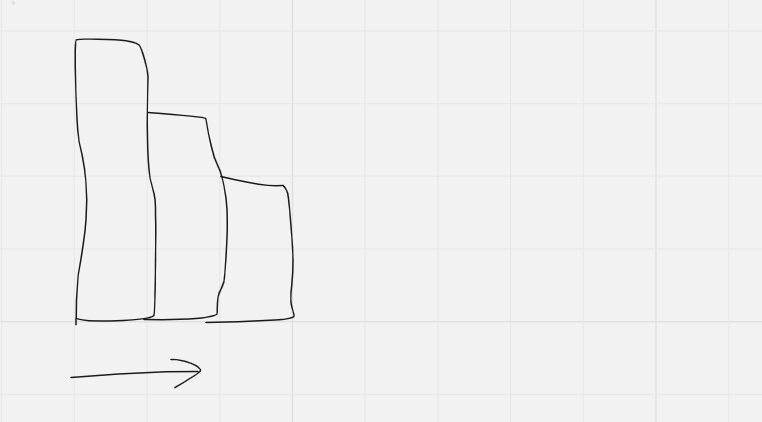
- Khi ta bắt gặp một vùng đất nhô cao lên, thì "chỗ trũng" mới hình thành:
    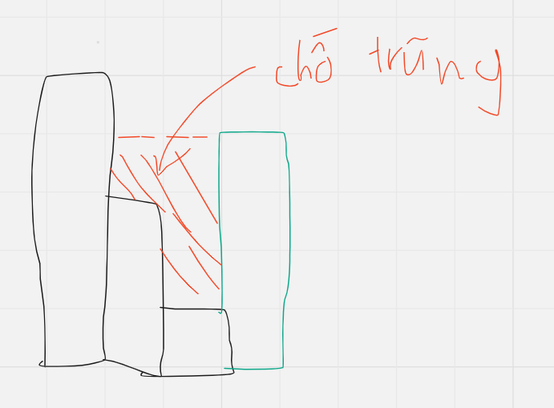
- Ý tưởng ở đây là, mỗi khi xuất hiện một chỗ trũng, ta sẽ đổ đầy nước vào chỗ trũng đó. Sau khi chỗ này đã đầy nước, ta coi như nó là một mặt phẳng.
    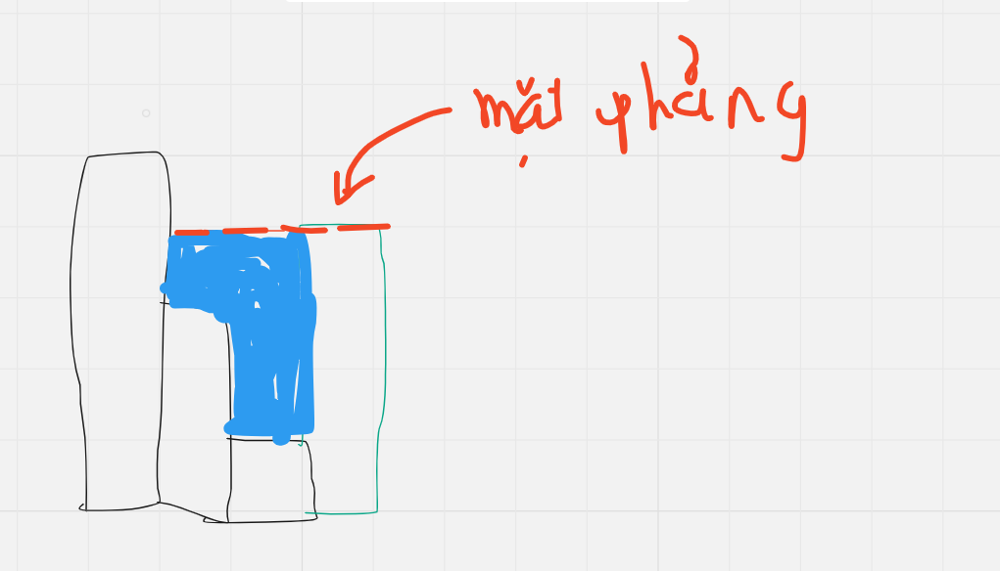
- Vậy, lượng nước đổ vào được tính như thế nào?
    - Ta xét các chỗ trũng mà chỉ gồm đúng 3 thành phần sau (gọi tắt là chỗ trũng **"phẳng"**):
    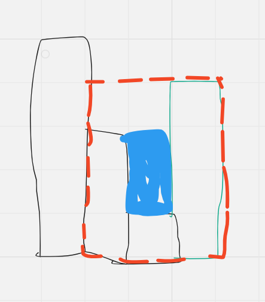
        - Vùng đất cao bên trái `leftWall`.
        - Vùng đất cao bên phải `rightWall`.
        - Vùng đất thấp ở giữa `bottom`.
    - Khi đó lượng nước được đổ vào chỗ trũng là: $(i_{rightWall} - i_{leftWall} + 1) \times (\min(h_{rightWall}, h_{leftWall}) - h_{bottom})$.
    - Ta để ý rằng, khi đổ đầy nước cho một chỗ trũng "phẳng", sẽ làm xuất hiện ra chỗ trũng phẳng khác, hoặc là một mặt phẳng.
        - Ví dụ, sau khi đổ đầy 1 chỗ trũng phẳng, thì sẽ xuất hiện một chỗ trũng phẳng khác:
        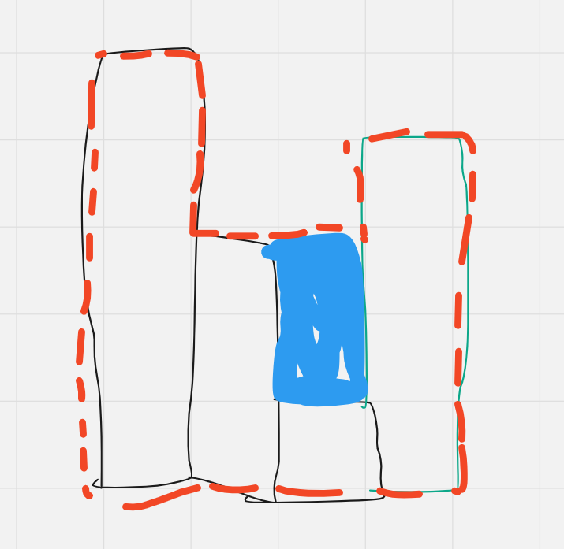
        - Tiếp tục đổ đầy chỗ trũng phẳng này, thì sẽ xuất hiện một mặt phẳng:
        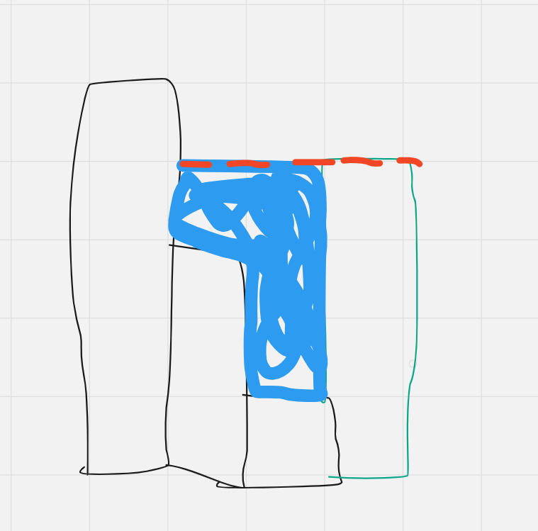
    - Vậy, ta có thể hình thành thuật toán "đổ nước" như sau:
        - Khởi tạo một stack rỗng.
        - Khi mà còn đang xuống dốc, push các cột vào stack.
        - Khi xuất hiện vùng trũng, ta tiến hành lần lượt đổ đầy nước vào các chỗ trũng phẳng (và pop các cột `leftWall` ra khỏi stack), việc này dừng khi không còn chỗ trũng phẳng nào nữa (tức là xuất hiện mặt phẳng).
            - Ví dụ:
            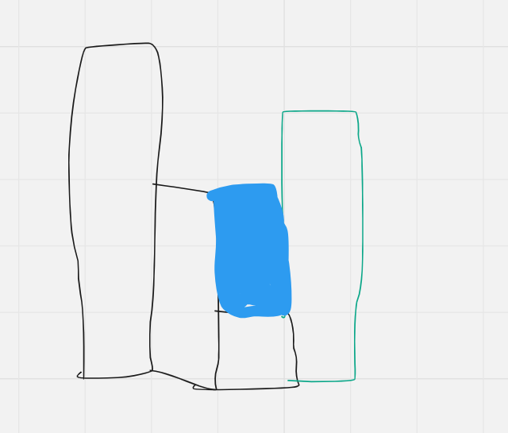
            Vẫn còn chỗ trũng phẳng, ta tiếp tục đổ:
            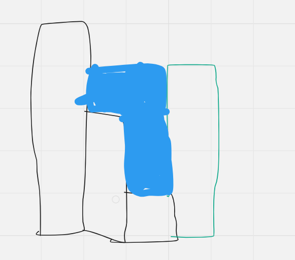
            Khi này xuất hiện mặt phẳng (không còn chỗ trũng phẳng), ta dừng.
        - Tiếp tục đi sang bên trái (trong hình trên, cột `rightWall` thấp hơn cột `leftWall` nên nó vẫn được push vào stack).
        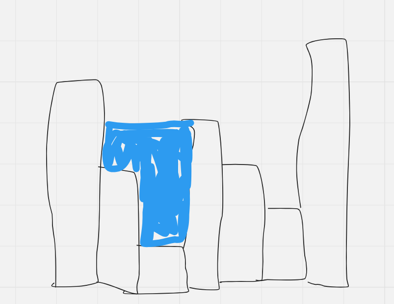
        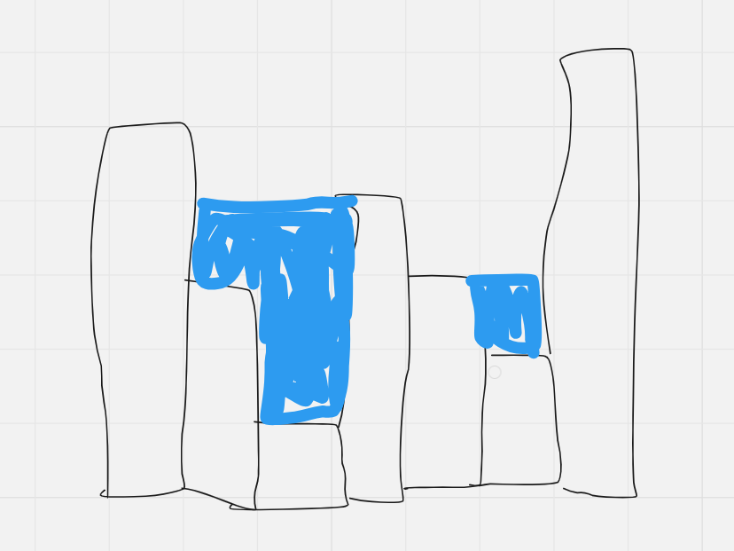
        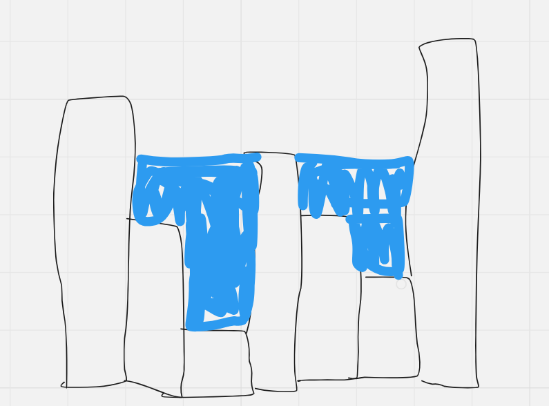
        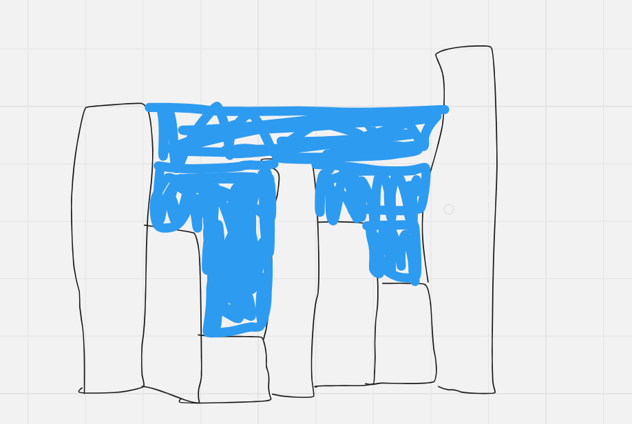
        
**Độ phức tạp**: